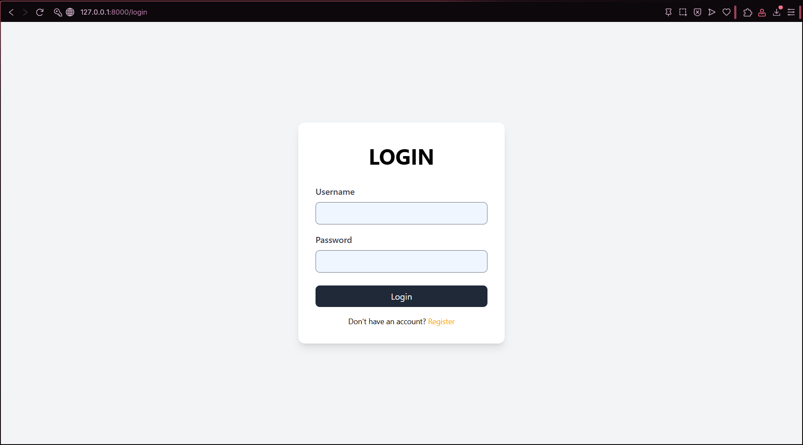
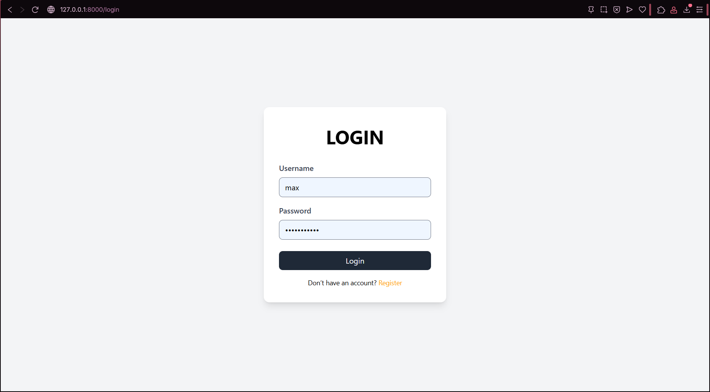
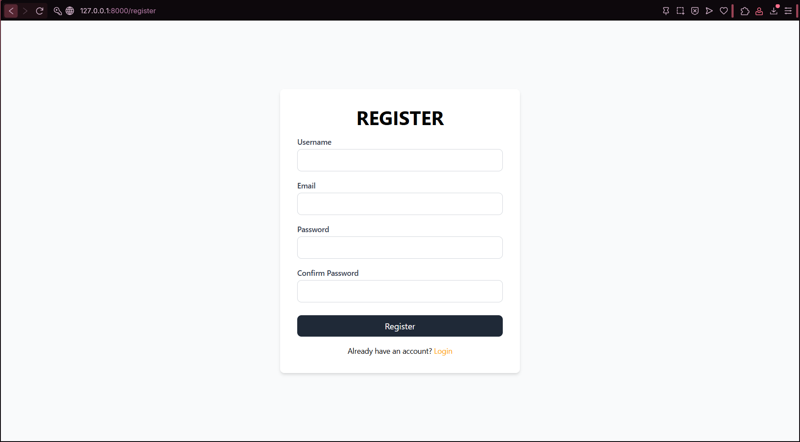
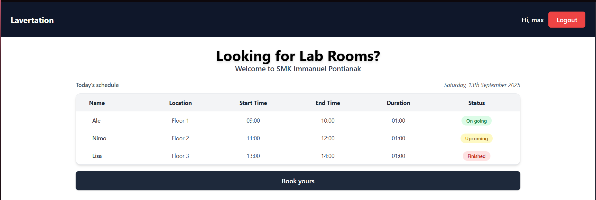
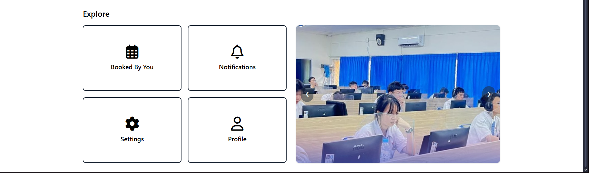

## Lavertation

Aplikasi Lab Reservation digunakan agar guru-guru yang ingin menggunakan lab sekolah secara bersamaan dapat mereservasi waktu pemakaian lab terlebih dahulu supaya tidak terjadi bentrokan jadwal pemakaian lab sekolah.

Ini tentunya menyelesaikan masalah dimana guru-guru yang membutuhkan lab perlu membatalkan rencana kegiatan atau menunggu lebih lama.

---

## Fitur
- Login & Register dengan autentikasi
- Dashboard dengan jadwal hari ini
- Explore menu (History, Notifications)
- Pembaruan status(Pending, Accepted, Rejected) dengan pengguna mendapatkan notifikasi
- Pembaruan jadwal yang otomatis

---
## Tech Stack
- Laravel 10
- Tailwind CSS
- MySQL
- Blade
---
## Dokumentasi






---
## 🛠️ Instalasi
1. Clone repository:
   ```bash
   git clone[https://github.com/elsyavindyy/Lavertation.git]
