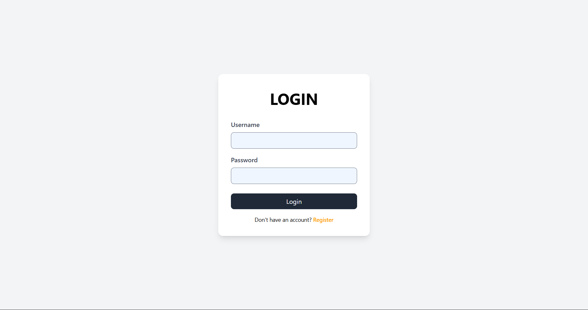
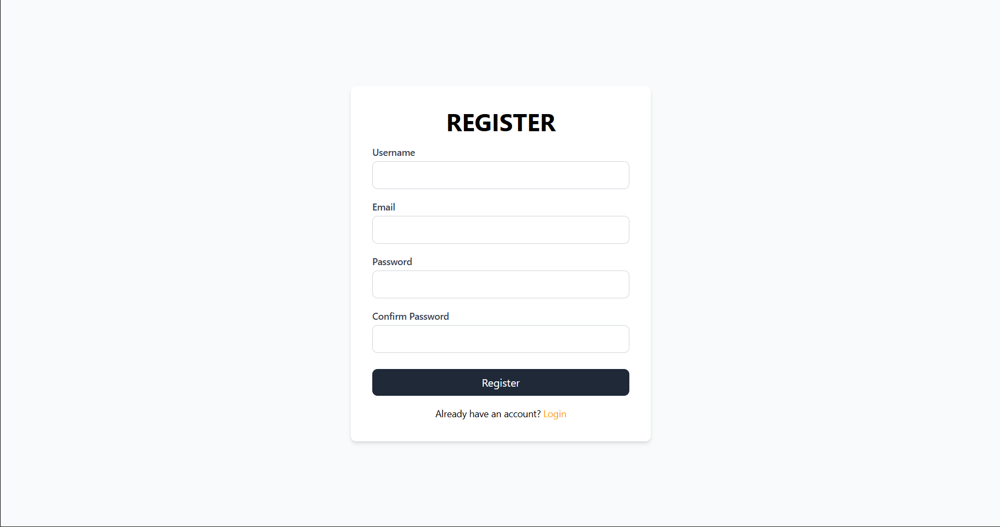
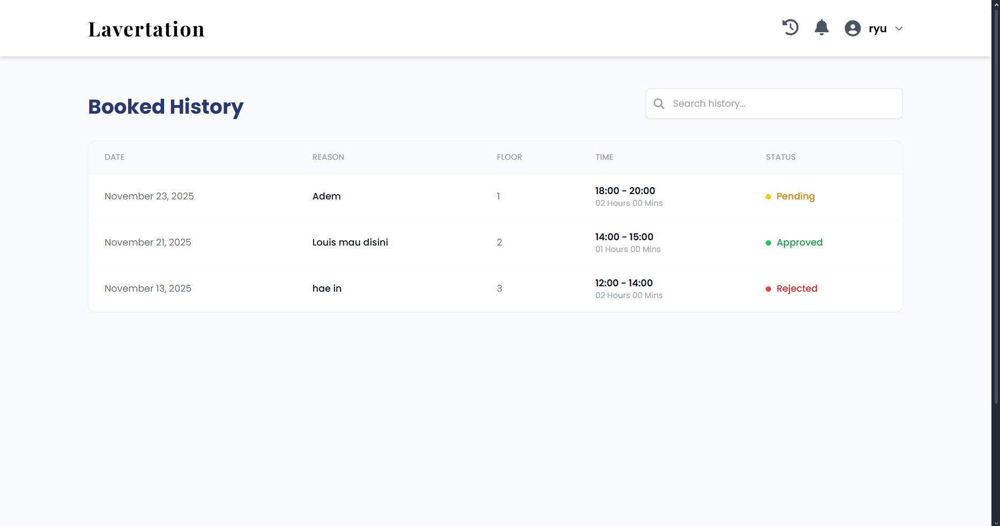
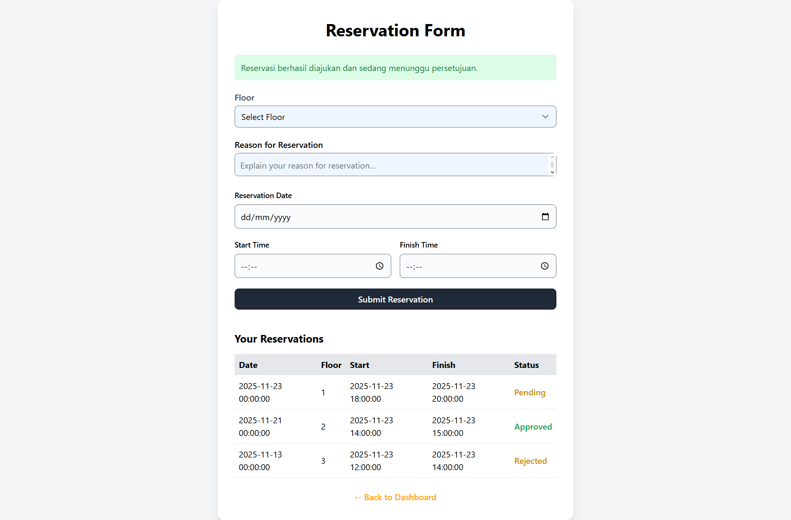
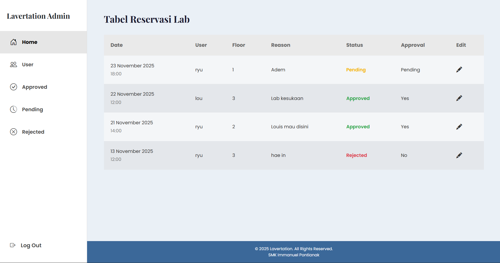

## Lavertation

Aplikasi Lab Reservation digunakan agar guru-guru yang ingin menggunakan lab sekolah secara bersamaan dapat mereservasi waktu pemakaian lab terlebih dahulu supaya tidak terjadi bentrokan jadwal pemakaian lab sekolah.

Ini tentunya menyelesaikan masalah dimana guru-guru yang membutuhkan lab perlu membatalkan rencana kegiatan atau menunggu lebih lama.

---

## Fitur
- Login & Register dengan autentikasi
- Dashboard dengan jadwal hari ini
- Explore menu (History, Notifications)
- Pembaruan status(Pending, Accepted, Rejected) dengan pengguna mendapatkan notifikasi
- Pembaruan jadwal yang otomatis

---
## Tech Stack
- Laravel 10
- Tailwind CSS
- MySQL
- Blade
---
## Dokumentasi


Halaman Register dan Login bekerja seperti di aplikasi lainnya pada umumnya. Register Username dan Password dan data tersebut akan tersimpan di database sehingga Anda bisa melakukan Login dengan Username dan Password yang sama.


Home Page pada Lavertation terdiri atas beberapa section dengan fungsi dan tujuan mereka masing-masing yang sudah jelas. Terdapat pemilihan lantai Lab yang disertakan dengan beberapa aturan pemakaian ruangan Lab.


Book History adalah fungsi dimana user dapat melihat riwayat pemakaian Lab beserta detail-detail jam dan tanggalnya.


Ini adalah form yang diisi saat membuat reserrvasi dimana Anda harus memasukkan tanggal dan jam yang pasti. Hasil reservasi kemudian harus di approve oleh Admin agar dapat dijalankan.


Ini adalah Admin Dashboard, ada tabel yang menunjukkan list reservasi user yang bisa diapprove maupun direject.


---
## 🛠️ Instalasi
1. Clone repository:
   ```bash
   git clone[https://github.com/elsyavindyy/Lavertation.git]
